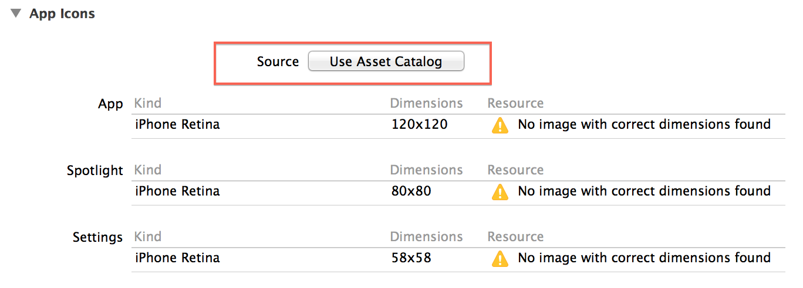
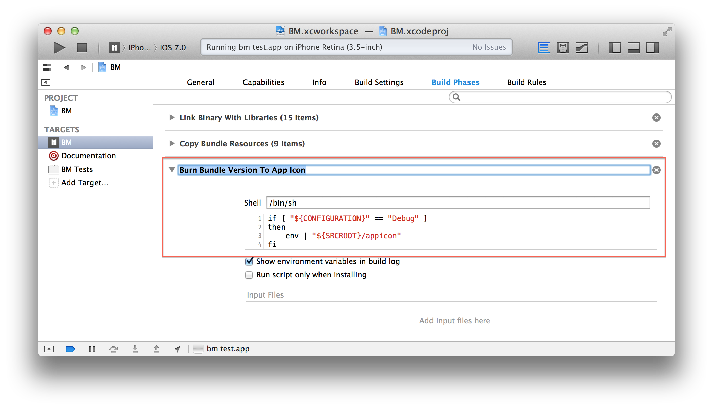

appicon
=======

Takes the CFBundleVersion key value from the Info.plist file and burns it over the AppIcon image

Requirements
------------
Your xcode project must be configured to use Asset Catalogs.


Installation
------------

1. Download and add [appicon](bin/appicon) executable to your projects root folder.
2. Add new "Run Script Build Phase" to your target using menu "Editor" → "Add Build Phase" → "Add Run Script Build Phase". Drag your newly created build phase to be executed after "Copy Bundle Resources" phase.
3. Insert following lines of code as the script body:
```
if [ "${CONFIGURATION}" == "Debug" ]
then
    env | "${SRCROOT}/appicon"
fi
```
At this point your build phases should look similar to this:


4. Build and Run.

And thats it. Got your Bundle Version burned over AppIcon image.
